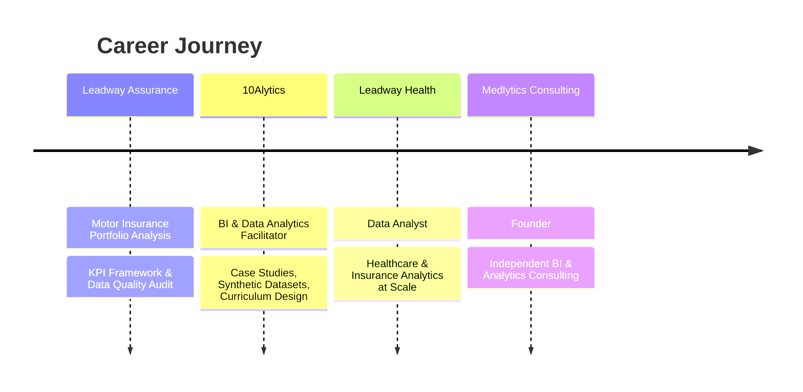

<svg width="100%" height="300" viewBox="0 0 900 300" xmlns="http://www.w3.org/2000/svg" role="img" aria-label="Oluwasegun Shobowale — Business Intelligence Consultant">
  <defs>
    <linearGradient id="bg" x1="0%" y1="0%" x2="100%" y2="100%">
      <stop offset="0%" stop-color="#060A1F"/>
      <stop offset="50%" stop-color="#0E1B4D"/>
      <stop offset="100%" stop-color="#1E3A8A"/>
    </linearGradient>
    <linearGradient id="accent" x1="0%" y1="0%" x2="100%" y2="0%">
      <stop offset="0%" stop-color="#3B82F6"/>
      <stop offset="100%" stop-color="#93C5FD"/>
    </linearGradient>
    <radialGradient id="glow" cx="50%" cy="0%" r="75%">
      <stop offset="0%" stop-color="#3B82F6" stop-opacity="0.25"/>
      <stop offset="100%" stop-color="#3B82F6" stop-opacity="0"/>
    </radialGradient>
  </defs>

  <rect width="900" height="300" rx="18" fill="url(#bg)"/>
  <rect width="900" height="300" rx="18" fill="url(#glow)"/>

  <circle cx="70" cy="45" r="1.6" fill="#93C5FD" opacity="0.6"/>
  <circle cx="820" cy="70" r="1.6" fill="#93C5FD" opacity="0.5"/>
  <circle cx="760" cy="230" r="1.6" fill="#93C5FD" opacity="0.4"/>
  <circle cx="120" cy="250" r="1.6" fill="#93C5FD" opacity="0.5"/>
  <line x1="0" y1="299" x2="900" y2="299" stroke="url(#accent)" stroke-width="2"/>

  <text x="450" y="120" text-anchor="middle" font-family="Helvetica, Arial, sans-serif" font-size="42" font-weight="700" fill="#F5F7FF" letter-spacing="2">OLUWASEGUN SHOBOWALE</text>

  <text x="450" y="160" text-anchor="middle" font-family="Helvetica, Arial, sans-serif" font-size="16" font-weight="500" fill="#93C5FD" letter-spacing="3">DATA ANALYST · BUSINESS INTELLIGENCE · AUDIT & RISK ANALYTICS</text>

  <rect x="325" y="182" width="250" height="1" fill="#2A3F73"/>

  <text x="450" y="215" text-anchor="middle" font-family="Georgia, 'Times New Roman', serif" font-size="19" font-style="italic" fill="#E2E8F7">Transforming Complex Data into</text>
  <text x="450" y="242" text-anchor="middle" font-family="Georgia, 'Times New Roman', serif" font-size="19" font-style="italic" fill="#E2E8F7">Executive Business Decisions.</text>

  <text x="450" y="278" text-anchor="middle" font-family="Helvetica, Arial, sans-serif" font-size="12" fill="#5D77B8" letter-spacing="4">FOUNDER · MEDLYTICS CONSULTING</text>
</svg>

 

<table align="center" width="100%">
<tr>
<td align="center" width="16%">

**🏥**
 
Healthcare Analytics

</td>
<td align="center" width="16%">

**🛡️**
 
Insurance Analytics

</td>
<td align="center" width="16%">

**📊**
 
Executive Dashboards

</td>
<td align="center" width="16%">

**🧠**
 
Business Intelligence

</td>
<td align="center" width="18%">

**🎓**
 
Analytics Instructor

</td>
<td align="center" width="18%">

**🚀**
 
Founder, Medlytics

</td>
</tr>
</table>

 

---

<h2 align="center">About</h2>

<table align="center">
<tr>
<td width="900">

I work at the intersection of data analytics, business intelligence, and risk-focused decision support — helping organizations turn complex operational and financial data into reliable evidence for better decisions.

My work involves cleaning, validating, reconciling, modelling and analysing data to uncover patterns, anomalies, performance gaps and potential areas of risk. I build analytical solutions that help answer not just what happened, but why it happened, where the exposure is, and what management should do next.

Using SQL, Power BI, DAX, Python and Advanced Excel, I develop dimensional data models, automated reporting solutions and executive dashboards that turn fragmented data into structured, decision-ready information.

I have worked across healthcare, insurance, operations and business analytics, including claims and financial analysis, performance monitoring, customer analytics and operational reporting. My projects often involve investigating discrepancies between data sources, validating analytical outputs and translating findings into clear recommendations.

I also train aspiring analysts in SQL, Excel and Power BI, which has strengthened my ability to communicate technical findings clearly to both technical and non-technical audiences.

</td>
</tr>
</table>

 

---

<h2 align="center">Core Expertise</h2>

<table>
<tr>
<td align="center" width="20%">📊 <b>Business Intelligence</b></td>
<td align="center" width="20%">📈 <b>Executive Reporting</b></td>
<td align="center" width="20%">🏥 <b>Healthcare Analytics</b></td>
<td align="center" width="20%">🛡️ <b>Insurance Analytics</b></td>
<td align="center" width="20%">🖥️ <b>Dashboard Development</b></td>
</tr>
<tr>
<td align="center">🗣️ <b>Data Storytelling</b></td>
<td align="center">📐 <b>Data Modelling</b></td>
<td align="center">🔄 <b>ETL</b></td>
<td align="center">🧭 <b>Decision Support</b></td>
<td align="center">🤝 <b>Analytics Consulting</b></td>
</tr>
<tr>
<td align="center" colspan="5">🎓 <b>Training &amp; Mentoring</b></td>
</tr>
</table>

 

---

<h2 align="center">What I Do</h2>

<table>
<tr>
<td align="center" width="20%">🏥 <b>Healthcare Analytics</b></td>
<td align="center" width="20%">🛡️ <b>Insurance Analytics</b></td>
<td align="center" width="20%">📊 <b>Executive Dashboards</b></td>
<td align="center" width="20%">⚡ <b>Power BI Solutions</b></td>
<td align="center" width="20%">🗄️ <b>SQL Development</b></td>
</tr>
<tr>
<td align="center">🔄 <b>ETL</b></td>
<td align="center">🧹 <b>Data Cleaning</b></td>
<td align="center">📐 <b>Data Modelling</b></td>
<td align="center">🎯 <b>KPI Framework Design</b></td>
<td align="center">🤝 <b>Analytics Consulting</b></td>
</tr>
<tr>
<td align="center" colspan="5">🏫 <b>Corporate Training</b></td>
</tr>
</table>

 

---

<h2 align="center" id="featured-projects">Featured Projects</h2>

<table align="center" width="100%">
<tr>
<td width="50%" valign="top">

<svg width="100%" height="160" viewBox="0 0 500 160" xmlns="http://www.w3.org/2000/svg">
  <defs><linearGradient id="p1" x1="0%" y1="0%" x2="100%" y2="100%"><stop offset="0%" stop-color="#0A0F2C"/><stop offset="100%" stop-color="#1E3A8A"/></linearGradient></defs>
  <rect width="500" height="160" rx="12" fill="url(#p1)"/>
  <text x="250" y="70" text-anchor="middle" font-family="Helvetica, Arial, sans-serif" font-size="15" fill="#93C5FD" letter-spacing="1">🏥 HEALTHCARE INSURANCE</text>
  <text x="250" y="95" text-anchor="middle" font-family="Helvetica, Arial, sans-serif" font-size="20" font-weight="700" fill="#F5F7FF">BI Dashboard</text>
</svg>

### Health Insurance BI Dashboard
**Nigerian HMO Claims &amp; Policy Analytics**

**Business problem:** Region-field mismatches between claims and policy tables were silently distorting the loss ratio leadership relied on.

Diagnosed the discrepancy, rebuilt the reporting layer, and delivered an executive suite covering broker vs. direct premium splits, NCD trends, effective premium rate, recovery rate, and settlement-lag buckets.

`Power BI` `DAX` `Data Modelling` `Excel`

</td>
<td width="50%" valign="top">

<svg width="100%" height="160" viewBox="0 0 500 160" xmlns="http://www.w3.org/2000/svg">
  <defs><linearGradient id="p2" x1="0%" y1="0%" x2="100%" y2="100%"><stop offset="0%" stop-color="#0A0F2C"/><stop offset="100%" stop-color="#1E3A8A"/></linearGradient></defs>
  <rect width="500" height="160" rx="12" fill="url(#p2)"/>
  <text x="250" y="70" text-anchor="middle" font-family="Helvetica, Arial, sans-serif" font-size="15" fill="#93C5FD" letter-spacing="1">🍁 HOSPITAL NETWORK</text>
  <text x="250" y="95" text-anchor="middle" font-family="Helvetica, Arial, sans-serif" font-size="20" font-weight="700" fill="#F5F7FF">MapleCare Analytics</text>
</svg>

### MapleCare Hospital Performance Analytics
**Canadian Hospital Network Performance**

**Business problem:** Five provincial branches needed one consistent view of cost, recovery outcomes, and bed utilization to compare fairly against each other.

Built a synthetic 8,000-row, 36-column model and 73 DAX measures spanning financials (CAD), recovery scoring, bed occupancy, and a three-part cost breakdown.

`Power BI` `DAX` `Financial Modelling` `Excel`

</td>
</tr>
<tr>
<td width="50%" valign="top">

<svg width="100%" height="160" viewBox="0 0 500 160" xmlns="http://www.w3.org/2000/svg">
  <defs><linearGradient id="p3" x1="0%" y1="0%" x2="100%" y2="100%"><stop offset="0%" stop-color="#0A0F2C"/><stop offset="100%" stop-color="#1E3A8A"/></linearGradient></defs>
  <rect width="500" height="160" rx="12" fill="url(#p3)"/>
  <text x="250" y="70" text-anchor="middle" font-family="Helvetica, Arial, sans-serif" font-size="15" fill="#93C5FD" letter-spacing="1">🚗 MOTOR INSURANCE</text>
  <text x="250" y="95" text-anchor="middle" font-family="Helvetica, Arial, sans-serif" font-size="20" font-weight="700" fill="#F5F7FF">Portfolio Profitability</text>
</svg>

### Motor Insurance Portfolio Profitability Analysis
**Leadway Assurance Portfolio Review**

**Business problem:** Missing vehicle-type data and inconsistent broker attribution made it impossible to price and evaluate the portfolio with confidence.

Audited data quality, flagged the missing claims data as a critical gap, and designed an eight-page KPI and dashboard framework with detailed claims-frequency methodology.

`Power BI` `Excel` `KPI Framework` `Data Quality`

</td>
<td width="50%" valign="top">

<svg width="100%" height="160" viewBox="0 0 500 160" xmlns="http://www.w3.org/2000/svg">
  <defs><linearGradient id="p4" x1="0%" y1="0%" x2="100%" y2="100%"><stop offset="0%" stop-color="#0A0F2C"/><stop offset="100%" stop-color="#1E3A8A"/></linearGradient></defs>
  <rect width="500" height="160" rx="12" fill="url(#p4)"/>
  <text x="250" y="70" text-anchor="middle" font-family="Helvetica, Arial, sans-serif" font-size="15" fill="#93C5FD" letter-spacing="1">🌍 GLOBAL HEALTH</text>
  <text x="250" y="95" text-anchor="middle" font-family="Helvetica, Arial, sans-serif" font-size="20" font-weight="700" fill="#F5F7FF">Mortality Trends</text>
</svg>

### Global Mortality Trends Analysis
**WHO Multi-Country HIV Time-Series (2000–2024)**

**Business problem:** Cross-country epidemiological data needed a model that supported reliable trend analysis without misleading composite metrics.

Designed a star schema over WHO time-series data, wrote SQL and DAX for 12 analytical questions, and validated metric definitions for conceptual accuracy before reporting.

`SQL` `Power BI` `Star Schema` `DAX`

</td>
</tr>
</table>

 

---

<h2 align="center">Technologies</h2>

 

 

 

---

<h2 align="center">Experience</h2>

 

---

<h2 align="center">Certifications</h2>

<table>
<tr>
<td align="center" width="25%">

**🏅 ALX Data Analytics**
 
Certified

</td>
<td align="center" width="25%">

**🏅 365 Data Science**
 
Certified

</td>
<td align="center" width="25%">

**🏅 Microsoft PL-300**
 
In Progress

</td>
<td align="center" width="25%">

**🏅 Next Certification**
 
Coming Soon

</td>
</tr>
</table>

 

---

<h2 align="center">Current Focus</h2>

<table>
<tr>
<td align="center" width="33%">📊 <b>Executive BI Dashboards</b></td>
<td align="center" width="33%">🏥 <b>Healthcare Decision Support</b></td>
<td align="center" width="33%">🛡️ <b>Insurance Portfolio Analytics</b></td>
</tr>
<tr>
<td align="center">📜 <b>Microsoft PL-300</b></td>
<td align="center">🐍 <b>Python</b></td>
<td align="center">🤖 <b>AI for Business Intelligence</b></td>
</tr>
<tr>
<td align="center" colspan="3">🚀 <b>Growing Medlytics Consulting</b></td>
</tr>
</table>

 

---

<h2 align="center">GitHub Analytics</h2>

 

 

 

 

 

 

---

<svg width="100%" height="30" viewBox="0 0 900 30" xmlns="http://www.w3.org/2000/svg">
  <path d="M0,15 C150,30 300,0 450,15 C600,30 750,0 900,15 L900,30 L0,30 Z" fill="#1E3A8A" opacity="0.5"/>
  <path d="M0,20 C150,5 300,30 450,15 C600,0 750,25 900,10 L900,30 L0,30 Z" fill="#3B82F6" opacity="0.35"/>
</svg>

### "Turning complex data into confident business decisions."

<svg width="100%" height="70" viewBox="0 0 900 70" xmlns="http://www.w3.org/2000/svg">
  <defs>
    <linearGradient id="footer" x1="0%" y1="0%" x2="100%" y2="0%">
      <stop offset="0%" stop-color="#060A1F"/>
      <stop offset="100%" stop-color="#1E3A8A"/>
    </linearGradient>
  </defs>
  <rect width="900" height="70" rx="14" fill="url(#footer)"/>
  <text x="450" y="42" text-anchor="middle" font-family="Helvetica, Arial, sans-serif" font-size="14" fill="#93C5FD" letter-spacing="2">THANK YOU FOR VISITING · LET'S BUILD YOUR NEXT DECISION</text>
</svg>

